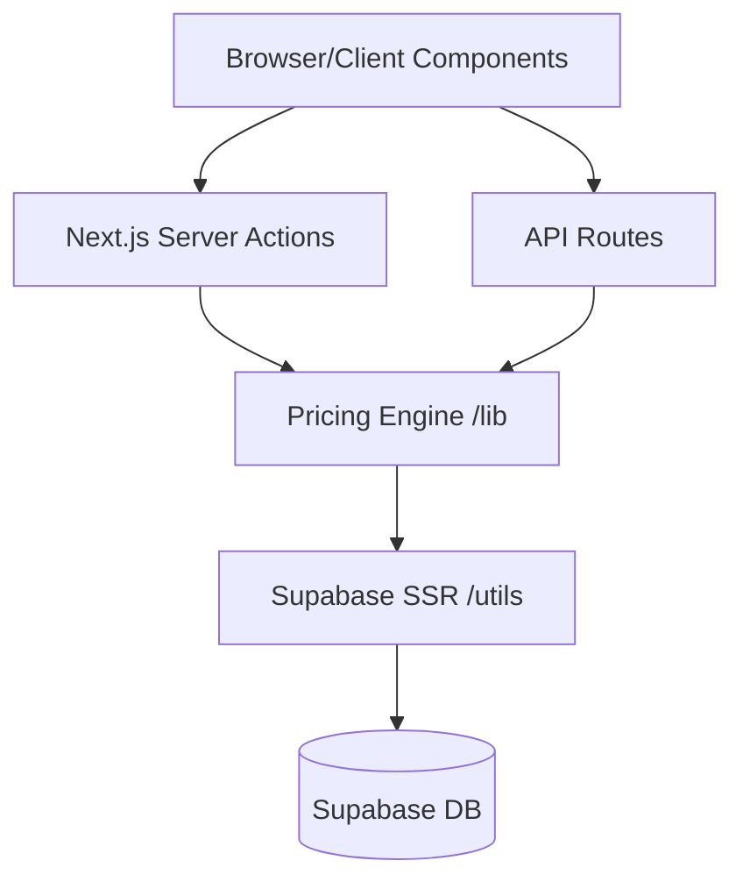

# Architecture

> Generated by Antigravity on 2026-04-28

## Overview
Next.js 15 App Router application with Supabase integration. Follows a "Service-Action-Component" pattern with logic concentrated in `src/lib`.

## System Diagram

## Components

### Pricing Engine
- **Purpose:** Centralizes all pricing logic (seasonal, weekends, holidays).
- **Location:** `src/lib/pricing-engine.ts`
- **Dependencies:** `supabaseServer`, `date-fns`, `systemConfigServer`.

### Admin Authentication
- **Purpose:** Simple email-based whitelisting for admin access.
- **Location:** `src/lib/adminAuth.ts`
- **Pattern:** Checks `ALLOWED_ADMIN_EMAILS` env var against logged-in user.

### Image Service
- **Purpose:** Handles image uploads and management.
- **Location:** `src/services/image-service.ts`

## Data Flow
1. User requests a range of dates on the frontend.
2. Frontend calls a Server Action or API Route.
3. Logic layer calls `PricingEngine.getPricingForRange`.
4. `PricingEngine` fetches base price, seasonal rules, and holidays from Supabase.
5. `PricingEngine` calculates total and breakdown.
6. Result returned to UI.

## Integration Points
| External Service | Type | Purpose |
|------------------|------|---------|
| Supabase | DB/Auth | Core data and user management |
| Resend | API | Sending status emails |

## Conventions
- **Naming:** CamelCase for files, camelCase for variables.
- **Structure:** `src/app` for routing, `src/components` for UI, `src/lib` for core logic.
- **Authentication:** Supabase SSR with cookies.

## Technical Debt
- [ ] Duplicate base price fetching logic in `pricing-engine.ts` and API routes.
- [ ] Hardcoded fallback prices (80000) in multiple files.
- [ ] Lack of Zod validation in many API routes.
- [ ] Email whitelisting for admin is hard to maintain vs Custom JWT Claims.
- [ ] Timezone handling using `T12:00:00` strings.
- [ ] Scattered `console.log` statements in production code.
